# Learnix

A learning management system: course catalog, lesson tracking, auto-graded
quizzes, certificates, and a full admin panel. Three roles, three interface
languages, and multilingual course content (including quizzes) at the
database level.

Capstone project. Backend — ASP.NET Core 8 (Clean Architecture, 7 projects),
frontend — vanilla JavaScript, no framework.

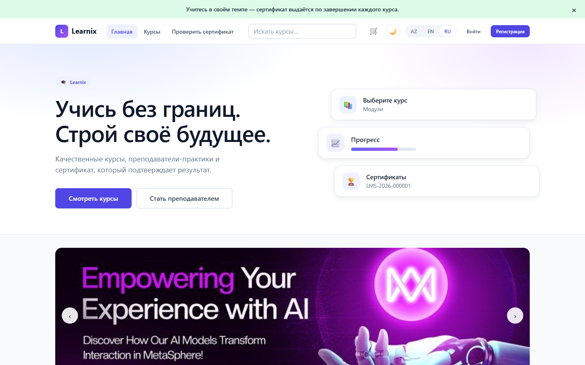

---

## Contents

- [What it does](#what-it-does)
- [Stack](#stack)
- [Architecture](#architecture)
- [Database schema](#database-schema)
- [File storage](#file-storage)
- [Getting started with Docker](#getting-started-with-docker)
- [Getting started without Docker](#getting-started-without-docker)
- [Demo accounts](#demo-accounts)
- [API](#api)
- [Screenshots](#screenshots)
- [Tests](#tests)
- [Decisions worth explaining](#decisions-worth-explaining)
- [What's out of scope](#whats-out-of-scope)

---

## What it does

### Student
Browses the catalog with filters, search, and sorting, saves courses to a
wishlist or a cart, enrolls, works through lessons with video and PDF
materials, takes quizzes (fully translated into all three languages),
tracks progress, and earns a certificate with a verifiable number.

### Instructor
Creates courses with an uploaded cover image, builds the curriculum from
modules and lessons via drag-and-drop, fills in content in all three
languages at once (courses, modules, lessons, quizzes), attaches PDF
materials to lessons, publishes, and sees analytics for their courses, the
student list, and reviews.

### Admin
A dedicated panel (own layout, own navigation) for platform-wide
operations: a dashboard with real charts (signups over time, courses by
status, users by role), user management (search, lock/unlock, delete),
course moderation (search, change status, delete, replace the cover image),
category management, and the homepage banner carousel.

### Anyone
Can verify a certificate by its number — **no account required**. This is
the only endpoint in the system that's open without authorization.

### A few things worth calling out
- **Real file uploads, not just links.** Avatars, course covers, PDF lesson
  materials, and homepage banners are all uploaded through the browser
  (picked from disk, no URL typing) and stored in MinIO, an S3-compatible
  object store running alongside the app.
- **Live notifications.** A bell icon in the navbar shows unread notifications
  (new enrollment, new review, quiz result, certificate issued, instructor
  reply) and pushes new ones instantly over SignalR — no polling, no page
  reload. The same event is also persisted, so the history survives a refresh.
- **Instructors can reply to reviews.** A reply is posted inline under the
  review, on the same page students see it, and triggers a notification back
  to the student.
- **Certificates carry a scannable QR code**, both in the downloaded PDF and
  on the certificate's own page, linking straight to the public verification
  page for that certificate number.
- **Password reset by email.** "Forgot password?" sends a real email through
  Gmail SMTP with a one-time reset link.
- **Dark theme.** Follows the system preference by default, with a manual
  toggle that's remembered per browser.
- **A cart that does something real.** There's no payment system, so
  "checkout" doesn't charge anything — it enrolls in every course in the
  cart in one action, using the same enrollment endpoint a single "Enroll"
  click would use.

---

## Stack

| Layer | Technology |
|---|---|
| API | ASP.NET Core 8, Swashbuckle (Swagger) |
| Data access | EF Core 8, SQL Server, Code First, Fluent API |
| Auth | ASP.NET Identity, JWT Bearer, Admin / Instructor / Student roles |
| File storage | MinIO (S3-compatible), one bucket per content type |
| Email | Gmail SMTP (password reset links) |
| Validation | FluentValidation |
| Mapping | AutoMapper |
| Real-time | SignalR (live notifications) |
| PDF | QuestPDF |
| QR codes | QRCoder (certificate PDF and page), qrcodejs (frontend, vendored locally) |
| Charts | Chart.js (admin dashboard only, vendored locally) |
| Tests | xUnit, Moq |
| Frontend | Vanilla JS (ES modules), Fetch API, CSS Custom Properties |
| Containers | Docker, Docker Compose (API + SQL Server + MinIO) |

No frontend framework by design: it was a requirement of the assignment.
There's no bundler — the browser loads ES modules directly.

---

## Architecture

```
LMSFinal.Domain          entities, enums, repository interfaces
LMSFinal.Contracts       DTOs — the only thing the outside world sees
LMSFinal.Application     services, business rules, validators, mapping
LMSFinal.Persistence     EF Core: DbContext, configurations, repositories, seed
LMSFinal.Infrastructure  external services: JWT, email, PDF generation, MinIO
LMSFinal.WebApi          controllers, middleware, Swagger, wwwroot
LMSFinal.Tests           xUnit + Moq
```

Dependencies point inward: `WebApi → Application → Domain`.
`Domain` doesn't know about anything else. `Persistence` implements the
interfaces declared in `Domain`, so `Application` works with the database
without knowing EF Core exists.

### Cross-cutting concerns

- **`GlobalExceptionMiddleware`** — a single place for error handling.
  Services just throw `NotFoundException` / `ForbiddenAccessException` /
  `ConflictException`, and controllers need no `try/catch` at all.
- **`ApiResponse<T>`** — a single response shape: `{ data, success, message, errors }`.
- **Repository + Unit of Work** — persistence happens in one transaction.
- **`TranslationResolver`** — picks a translation with a fallback chain:
  requested language → AZ → EN → whatever's available. Used for courses,
  modules, lessons, and quizzes/questions/answers.
- **`IEmailSender`** — a thin abstraction over SMTP, so `AuthService` sends
  emails without knowing or caring how they're actually delivered.
- **`IFileStorageService`** — a thin abstraction over MinIO, shared by
  avatar upload, course thumbnails, lesson materials, certificate caching,
  and the homepage banner carousel.
- **`INotificationPublisher`** — a thin abstraction over SignalR, so
  `NotificationService` can push a live update without `Application` knowing
  a real-time layer exists at all.

---

## Database schema

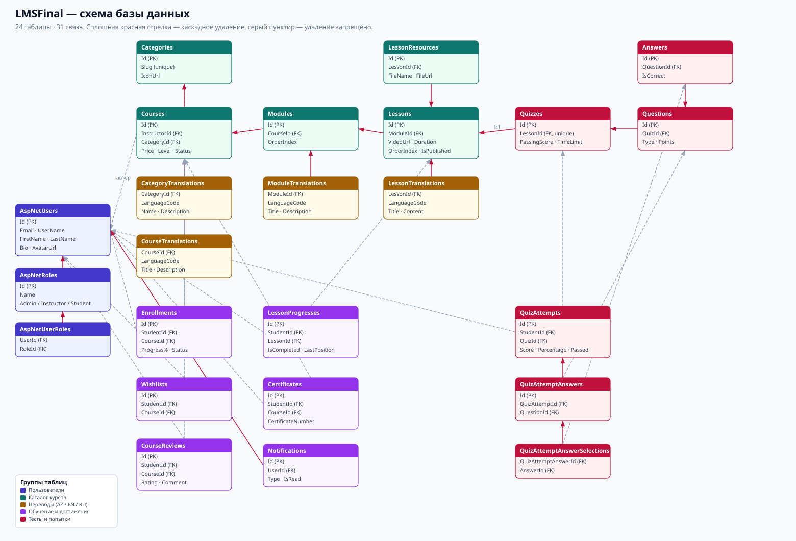

The diagram shows the app's own tables plus `AspNetUsers` and `AspNetRoles`
from Identity (the rest of Identity's internal tables are omitted to keep
the diagram readable).

Key decisions:

**Course, lesson, and quiz content is translated in the database, not in the
UI.** A lesson's title and body live in `LessonTranslations`, one row per
language, and the API returns the right one based on the `?lang=` parameter.
Quizzes follow the exact same pattern (`QuizTranslations` → `QuestionTranslations`
→ `AnswerTranslations`). This is a separate mechanism from UI translation —
the interface itself is translated client-side from `/locales/*.json`.

**Deletion is deliberate, not default.** A module deletes along with its
lessons (`Cascade`) — they're meaningless without the course. A course with
enrolled students can't be deleted at all (`Restrict`): deleting it would
also wipe out progress, grades, and issued certificates.

**A quiz result is reconstructible.** `QuizAttempts` stores not just the
score but every option the student picked (`QuizAttemptAnswerSelections`).
The score can be recomputed from the saved answers and checked — it isn't
"just a number in a column."

---

## File storage

Every uploaded file — avatars, course cover images, PDF lesson materials,
generated certificate PDFs, and homepage banners — goes through one
interface, `IFileStorageService`, backed by MinIO:

| Bucket | Contents | Access |
|---|---|---|
| `avatars` | profile photos | public read |
| `course-thumbnails` | course cover images | public read |
| `lesson-materials` | PDF attachments per lesson | public read |
| `hero-slides` | homepage carousel banners | public read |
| `certificates` | generated certificate PDFs, cached after first download | private, served through an authorized endpoint |

Certificates are the one exception to "public read": a PDF is generated
once with QuestPDF, cached in MinIO, and every later download of the same
certificate serves the cached file instead of regenerating it — but the
download itself always goes through the authenticated, ownership-checked
API endpoint rather than a direct public URL.

---

## Getting started with Docker

The whole stack (API + SQL Server + MinIO) runs in containers — no local
.NET SDK, SQL Server, or MinIO install needed, just Docker Desktop.

**1. Secrets.** Copy the sample and fill it in:

```bash
copy .env.example .env
```

Fill in a SQL Server password, a JWT key, the seed admin/demo passwords,
MinIO credentials, and (optionally) Gmail SMTP credentials for password
reset emails — a Gmail **app password**, not the regular account password
(Google only issues one once 2-Step Verification is turned on, under
[myaccount.google.com/apppasswords](https://myaccount.google.com/apppasswords)).
`.env` is excluded from git; only `.env.example` is committed.

**2. Build and run.**

```bash
docker compose up --build -d
```

This builds the API image, starts SQL Server and MinIO, waits for both to
report healthy, then starts the API — which applies migrations, creates the
MinIO buckets, and seeds demo data into the fresh database automatically.
The app is reachable at `http://localhost:5204`.

**3. Stop / restart.**

```bash
docker compose stop      # keeps containers and data, just stops them
docker compose up -d     # starts them again, no rebuild needed
docker compose down      # removes the containers (data survives — see below)
docker compose down -v   # removes containers AND all volumes (database + files)
```

Named volumes (`sql-data`, `minio-data`) persist data across rebuilds. Only
`down -v` wipes them — a plain `down` or a rebuild leaves them intact.

---

## Getting started without Docker

### Requirements
- .NET SDK 8.0
- SQL Server (LocalDB or Express both work)
- A MinIO instance (or any S3-compatible endpoint) reachable from the app

### Steps

**1. Configuration.** Copy the sample and fill it in:

```bash
cd LMSFinal.WebApi
copy appsettings.Development.example.json appsettings.Development.json
```

Fill in the connection string, a JWT key (32+ characters), the passwords,
and the `Storage` section (MinIO endpoint + credentials). The `Email`
section is optional — leave `SenderEmail`/`SenderPassword` blank and the
app runs fine; "Forgot password?" just logs a delivery failure instead of
sending a real email.

> `appsettings.Development.json` is excluded from git — it holds secrets.
> Only the sample with empty placeholders is committed to the repo.

**2. Database.** Migrations run automatically on first startup. To apply
them manually:

```bash
dotnet ef database update --project LMSFinal.Persistence --startup-project LMSFinal.WebApi
```

**3. Run.**

```bash
dotnet run --project LMSFinal.WebApi
```

The app comes up at `http://localhost:5204`. The frontend is served by the
same app from `wwwroot` — no separate server is needed, so CORS isn't
configured at all.

On first run the database is seeded with demo data: 10 courses, 23 modules,
51 lessons, 13 quizzes (fully translated into AZ/EN/RU), 9 students with
real progress and certificates. Toggle it off with the `Seed.EnableDemoData`
flag.

---

## Demo accounts

| Role | Email | Password |
|---|---|---|
| Student | `student@lms.com` | set via `Seed.DemoPassword` |
| Instructor | `instructor@lms.com` | set via `Seed.DemoPassword` |
| Admin | `admin@lms.com` | set via `Seed.AdminPassword` |

The login page has one-click buttons that fill these credentials into the form.

---

## API

Swagger lives at `/swagger`. Endpoints are grouped by user scenario, each
with a description, response codes, and example request bodies.

Groups at a glance:

| Group | What it does |
|---|---|
| `/api/auth` | registration, login, profile, avatar upload, forgot/reset password |
| `/api/courses` | catalog with filters and search, course details, instructor CRUD, cover upload |
| `/api/modules`, `/api/lessons` | course curriculum, reordering, PDF material upload |
| `/api/enrollments` | enrolling, "my courses" |
| `/api/progress` | marking a lesson done, completion percentage, "continue" |
| `/api/quizzes` | quizzes and **server-side** answer checking, multilingual editor payload |
| `/api/certificates` | my certificates, cached PDF download, **public verification by number** |
| `/api/hero-slides` | homepage banner carousel (public read) |
| `/api/admin` | dashboard stats, user management, course moderation, banner upload |
| `/api/reviews`, `/api/wishlist`, `/api/gradebook`, `/api/analytics` | reviews (including instructor replies), wishlist, gradebook, analytics |
| `/api/notifications` | notification history, mark as read, delete a read notification |
| `/hubs/notifications` | SignalR hub — live push of new notifications to the signed-in user |

### How security works

- Passwords are hashed by ASP.NET Identity; no plaintext ever hits the database.
- Access is checked **by ownership, not just by role**: an instructor can
  only edit their own courses, a student can only see their own certificates.
- **Correct quiz answers are never sent to the client** — every option in
  the API response has `isCorrect: null`. Only the server computes the score.
- Lesson content is instructor-authored HTML, so it's sanitized against an
  allowlist before being inserted into the page (`js/sanitize.js`).
- **Password reset never confirms whether an email is registered.** Both
  "email exists" and "email doesn't exist" return the same 200 response —
  the same principle already used for login's generic "wrong email or password".
- **An admin can lock an account, and locking actually blocks login** —
  `LoginAsync` checks `IsLockedOutAsync` before issuing a token, not just
  the password.
- **Uploaded files are validated server-side**: extension allowlist and a
  size cap per upload type (avatars, course covers, lesson materials,
  banners each have their own limits).

---

## Screenshots

### Student

| | |
|---|---|
| 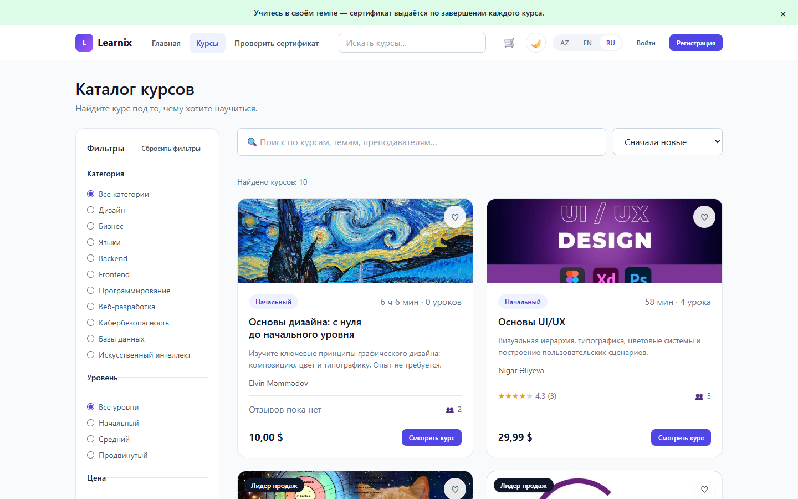 **Catalog with filters** | 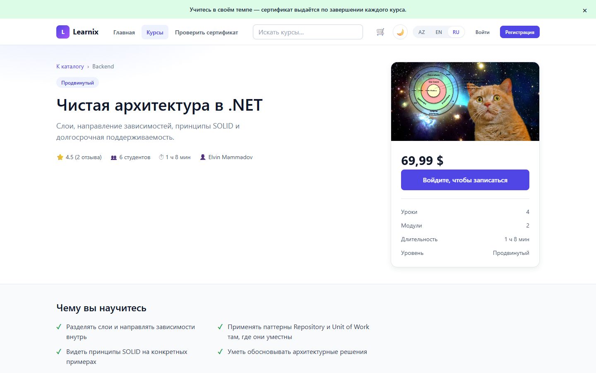 **Course page** |
| 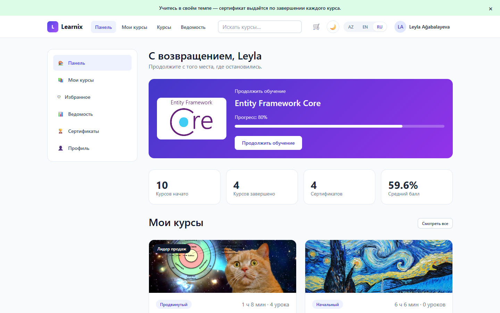 **Student dashboard** | 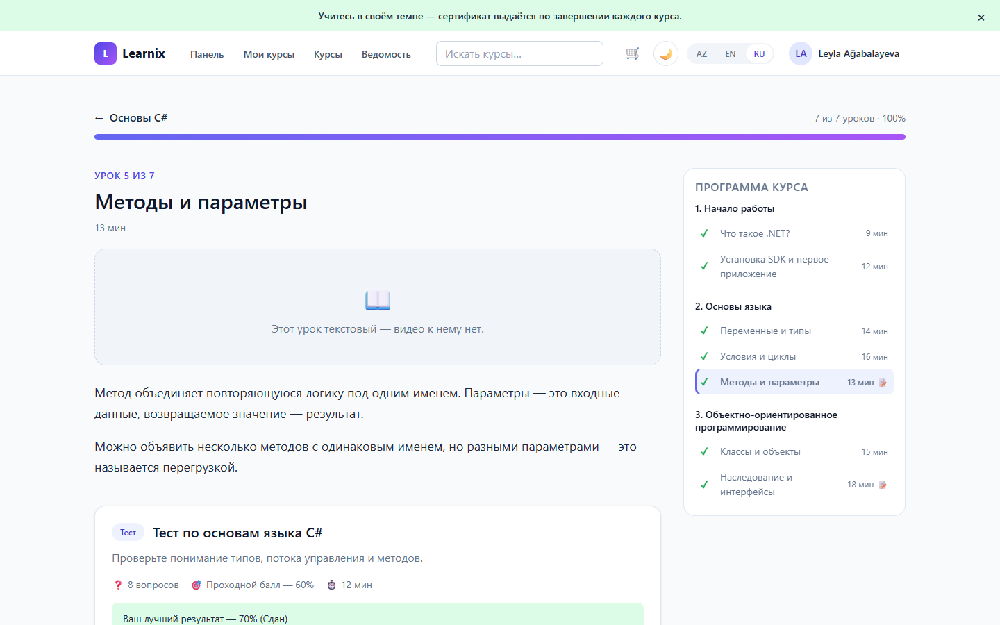 **Lesson and quiz** |
| 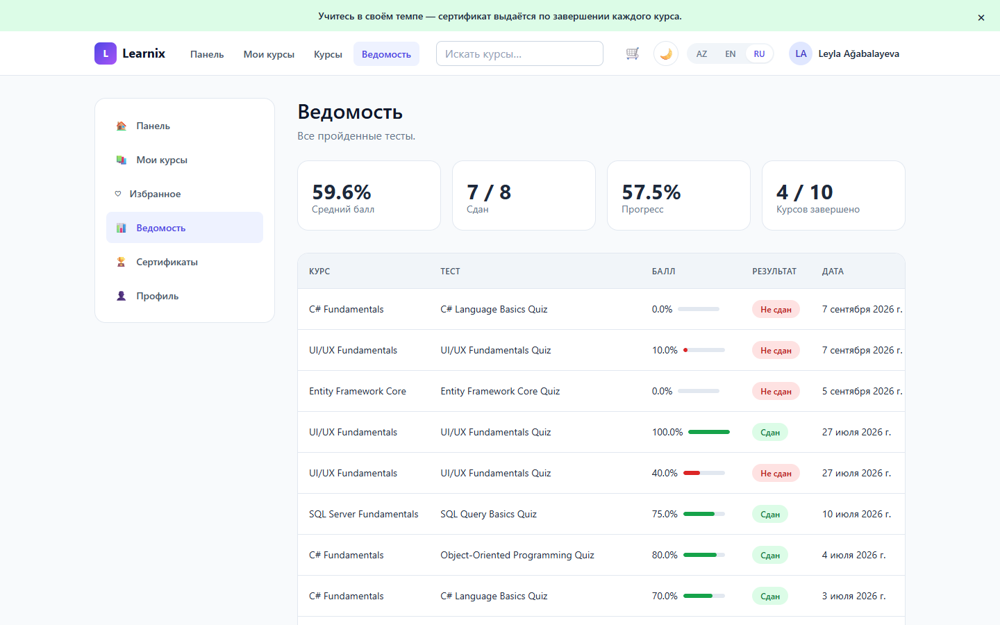 **Gradebook** | 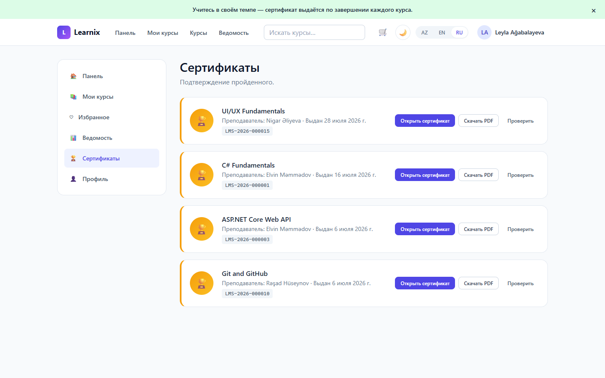 **Certificate** |

### Instructor

| | |
|---|---|
| 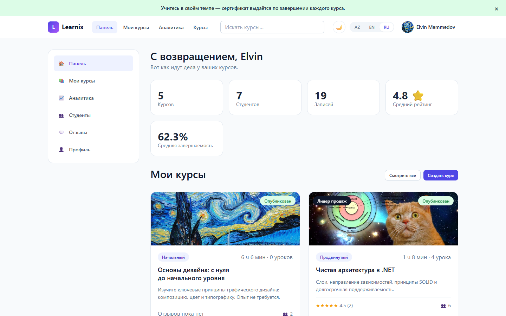 **Instructor dashboard** | 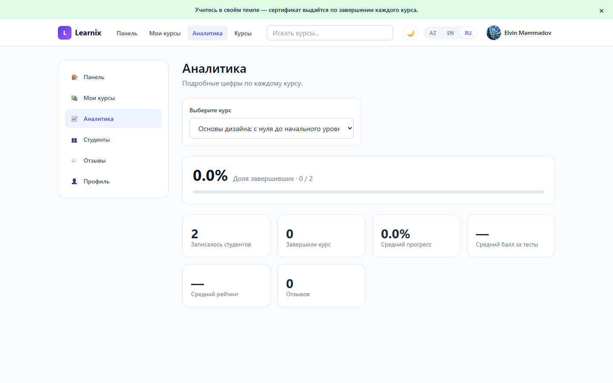 **Course analytics** |
| 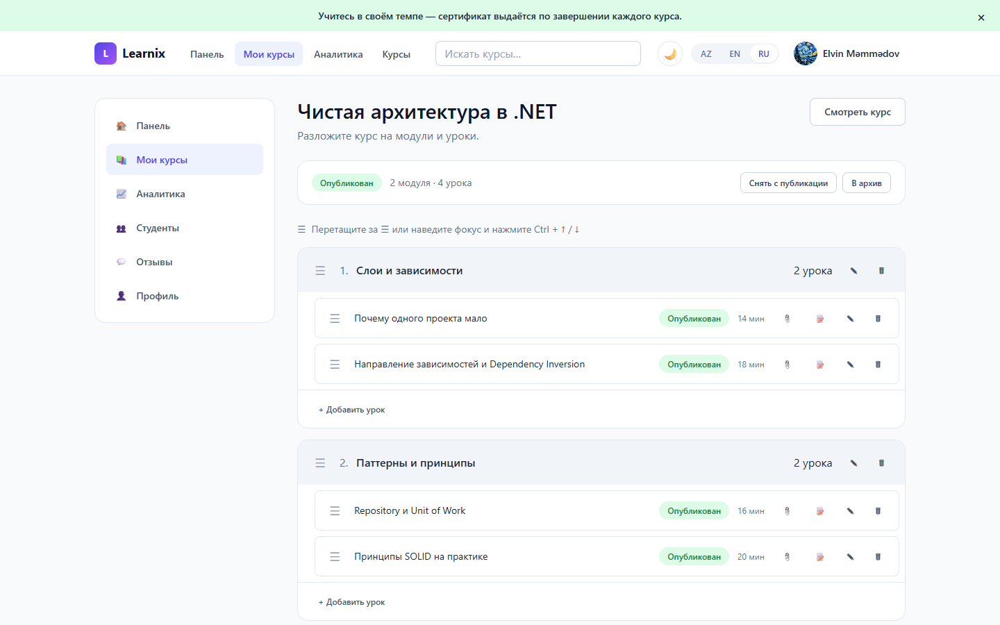 **Course builder** | 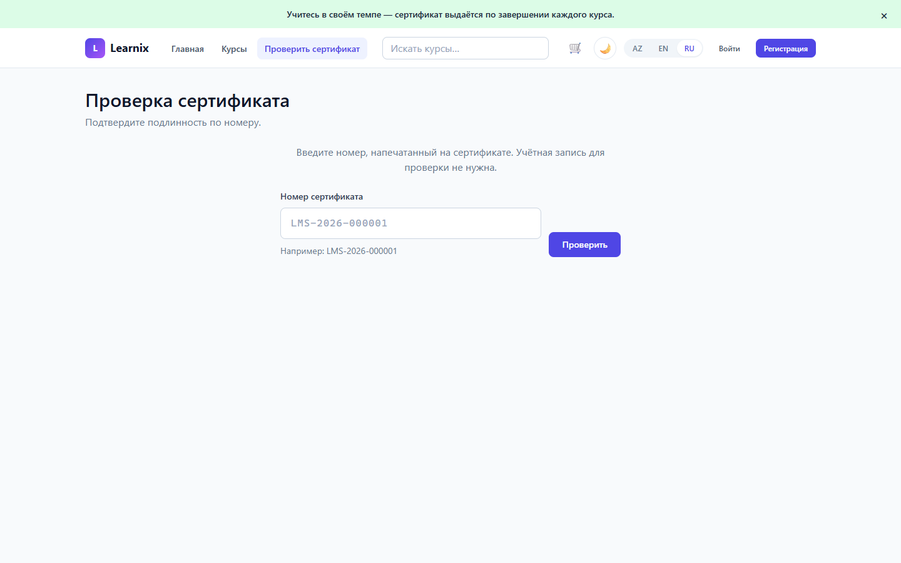 **Public certificate verification** |

### Admin

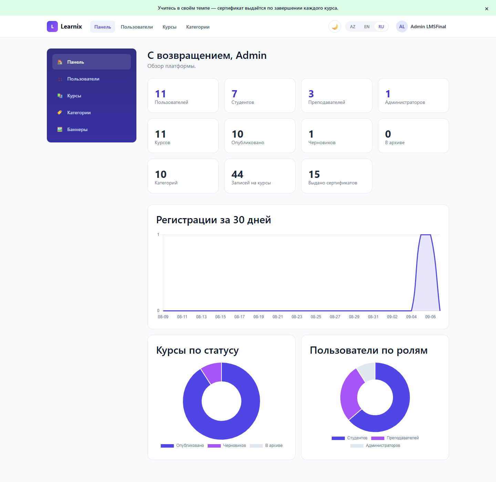

### Mobile

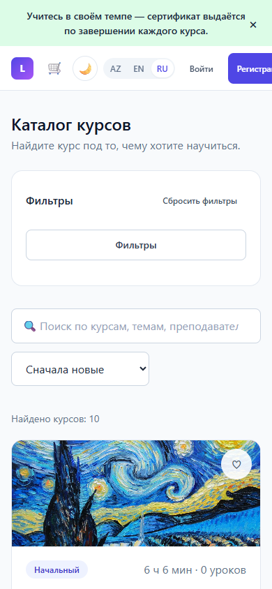

Tested at 375px: no horizontal scrolling on any page, tables scroll within
themselves, tap targets are 44px.

### Light & dark theme

| Light | Dark |
|---|---|
|  | 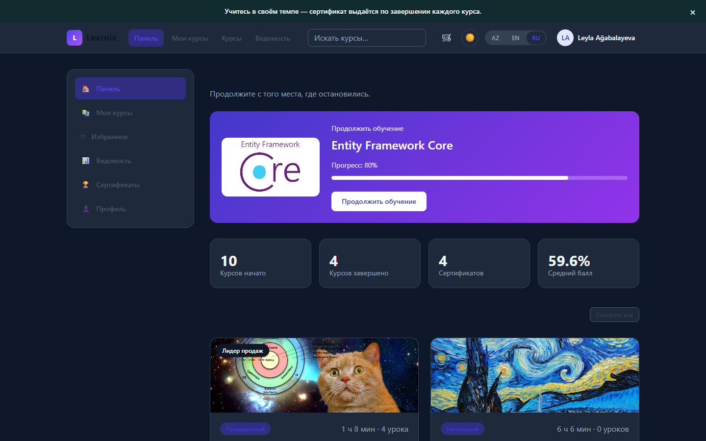 |

---

## Tests

```bash
dotnet test
```

102 tests, xUnit + Moq. They cover business rules, not getters:

| What's covered | Tests |
|---|---|
| Progress formula, recomputation, list of completed lessons | 15 |
| Certificate issuance: 100% **and** all quizzes passed | 14 |
| Course creation and edit permissions | 15 |
| Quiz scoring, exact answer matching | 12 |
| Reviews only from enrolled students, one per course | 10 |
| Registration and login | 8 |
| Enrollment and re-enrollment | 8 |
| Forgot/reset password: email sent only for known accounts, tokens validated, malformed tokens rejected | 5 |

---

## Decisions worth explaining

**No partial credit on quizzes.** A question only counts as correct when the
selected set of options exactly matches the correct set — no extra option,
none missing. This is a deliberate simplification.

**Progress only counts published lessons.** An instructor's draft shouldn't
lower a student's completion percentage — the student can't even see it.

**Certificates can't be requested.** There's no "give me a certificate"
endpoint. The server issues one on its own once two conditions are both
met: 100% of lessons done and every quiz in the course passed. The check is
idempotent — the certificate is only ever created once.

**Switching language doesn't reload the page.** The UI re-renders in place,
and course content is re-fetched with the new `?lang=` — these are two
separate mechanisms.

**The cart has no fake urgency or discounts.** There's no payment gateway,
so a Udemy-style banner with a countdown and a slashed-out price would just
be invented numbers. The homepage banner is honest copy instead, and the
cart's "Checkout" does exactly one real thing: enroll in every course in
the cart.

**A course's bestseller badge is computed, not stored.** It only appears
when a course's real rating and review count both clear a threshold —
there's no `IsBestseller` flag an instructor can just flip on.

**Notification persistence and live delivery are two separate concerns.**
`NotificationService.NotifyAsync` always writes to the database first — a
notification exists whether or not the recipient is online. Live delivery
is a second, optional step behind its own interface, `INotificationPublisher`,
implemented with SignalR in the WebApi layer. `Application` depends only on
the interface, so it has no idea SignalR exists — the same pattern already
used for `IEmailSender` and `IFileStorageService`.

**Explicit `DbSet.Update()` calls were removed from update paths that touch
translations.** Calling `Update()` on an entity that's already tracked by the
same `DbContext` walks its whole navigation graph and marks every reachable
row `Modified` — including brand-new translation rows that were just
`Add()`-ed to the collection, whose primary key is non-empty (`BaseEntity`
assigns a `Guid` at construction). EF then emits an `UPDATE` for a row that
doesn't exist yet, matches zero rows, and throws
`DbUpdateConcurrencyException`. The fix is two-fold: drop the redundant
`Update()` call (the tracked entity's changes are picked up automatically),
and set `Id = Guid.Empty` on newly created translation rows so EF's own
"does this look brand new" heuristic classifies them correctly.

---

## What's out of scope

An honest list — these things are not done in this project:

- **Certificate numbers are sequential** (`LMS-2026-000001`, `-000002`).
  Verification is public with no rate limiting, so brute-forcing could
  enumerate the list of graduates. Fixable with rate limiting.
- **Payments aren't implemented.** Courses have a price, but enrollment
  (including "checkout" from the cart) is free.
- **Unused packages remain in the `.csproj` files** — Stripe, Twilio, Quartz,
  a PostgreSQL driver, Playwright, Serilog. None of them appear anywhere in the code.
- **The homepage carousel has no reordering UI.** An admin can add and
  delete banners; changing their order requires deleting and re-adding.
